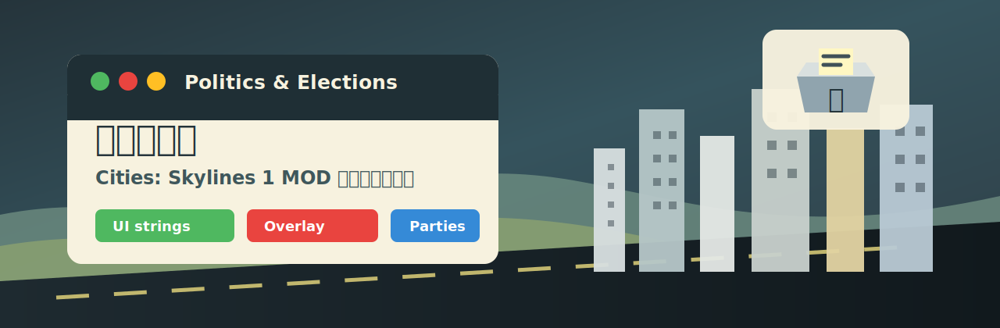

# Cities: Skylines Politics Japanese Patch



[日本語](README.ja.md) | [Docs](docs/index.md) | [Notice](NOTICE.md)

Local Japanese localization patcher for the Cities: Skylines 1 Workshop mod
"Politics & Elections".

This project packages the patcher that was built to translate the mod UI,
including the main panel, election states, overlay labels, party names, policy
text, and saved default party names. It patches your locally installed mod DLL
and creates a timestamped backup before changing it.

## What It Changes

- Translates visible UI strings to Japanese.
- Renames enum labels used by the mod UI, including election phases and overlay modes.
- Translates default party names and short labels where the mod reads or displays them.
- Keeps the original Workshop mod outside this repository.

## Requirements

- Windows
- Cities: Skylines 1 installed through Steam
- Workshop mod `3718153788` installed: Politics & Elections
- .NET Framework compiler from Windows (`csc.exe`)
- The game's bundled `Mono.Cecil.dll`

The scripts auto-detect common Steam paths, including:

- `D:\SteamLibrary\steamapps\common\Cities_Skylines`
- `D:\SteamLibrary\steamapps\workshop\content\255710`
- common `C:\Program Files` Steam locations

## Quick Start

Close Cities: Skylines first.

```powershell
cd D:\Prj\cities-skylines-politics-ja-patch
powershell.exe -NoProfile -ExecutionPolicy Bypass -File .\tools\apply-patch.ps1
```

If your Steam library is somewhere else:

```powershell
powershell.exe -NoProfile -ExecutionPolicy Bypass -File .\tools\apply-patch.ps1 `
  -GameRoot "E:\SteamLibrary\steamapps\common\Cities_Skylines" `
  -WorkshopRoot "E:\SteamLibrary\steamapps\workshop\content\255710"
```

If the game is still running and you want the script to close it:

```powershell
powershell.exe -NoProfile -ExecutionPolicy Bypass -File .\tools\apply-patch.ps1 -ForceStopGame
```

## Manual Build

```powershell
powershell.exe -NoProfile -ExecutionPolicy Bypass -File .\tools\build.ps1
.\bin\Release\PoliticsJaPatch.exe "D:\SteamLibrary\steamapps\workshop\content\255710\3718153788\Cities-Skyline-Politics-Mod.dll"
```

## Safety

The helper script creates a backup beside the target DLL:

```text
Cities-Skyline-Politics-Mod.dll.codex-ja-backup-YYYYMMDD-HHMMSS
```

To restore, close the game and copy that backup over
`Cities-Skyline-Politics-Mod.dll`.

## Project Layout

```text
src/PoliticsJaPatch.cs      Patcher source
tools/build.ps1             Build helper
tools/apply-patch.ps1       Build, backup, and patch helper
tools/validate-repo.ps1     Repository QA checks
docs/                       User and maintainer docs
```

## Scope

This repository only contains patching code and documentation. It does not
bundle the original Workshop DLL, game files, or third-party binaries.

## Validation

```powershell
powershell.exe -NoProfile -ExecutionPolicy Bypass -File .\tools\validate-repo.ps1
```

On a machine with Cities: Skylines installed, also run:

```powershell
powershell.exe -NoProfile -ExecutionPolicy Bypass -File .\tools\build.ps1
```
